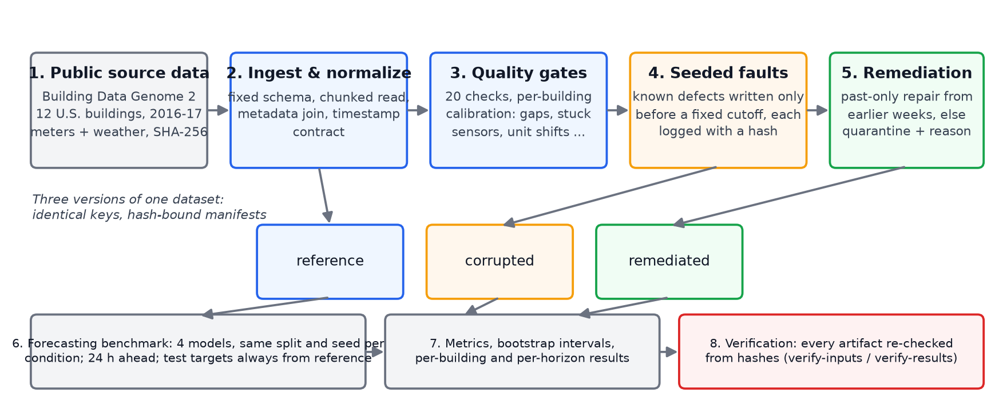
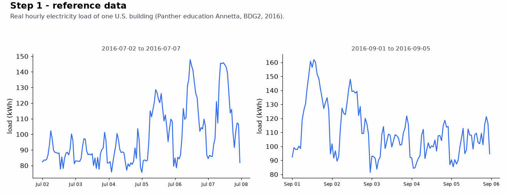
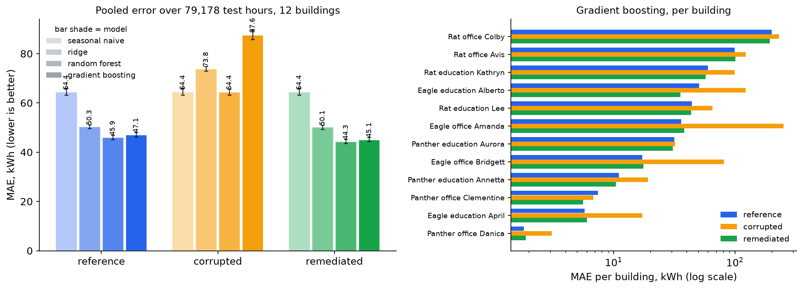
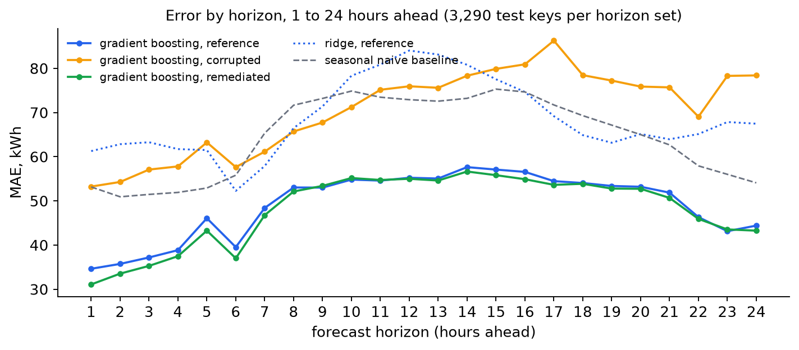
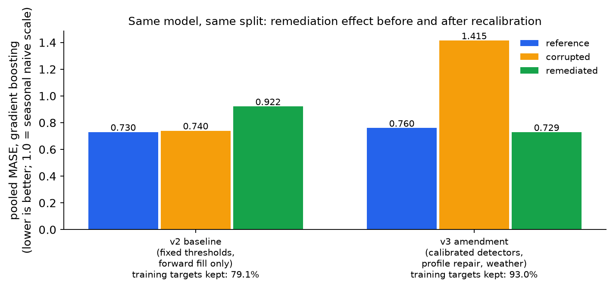

# Energy Data Onboarding and Demand Forecasting

[](https://github.com/LIANGYIXUAN3335/energy-data-onboarding-forecasting/actions/workflows/verify.yml)


**A data-quality pipeline for U.S. building electricity meters, and a
controlled experiment showing that it protects a next-day demand forecast from
real-world data defects.**

Author: Yixuan Liang · Data: Building Data Genome 2 (public; 12 U.S. buildings,
2016–2017) · Every number below is computed from committed, hash-verified
artifacts; see [Why you can trust the numbers](#why-you-can-trust-the-numbers).

> **In one paragraph.** Electric utilities are starting to rely on AI models
> to predict tomorrow's demand. Those models learn from meter readings, and
> meter readings are often wrong: a sensor gets stuck, a building reads zero
> for hours, a unit changes by a factor of 100. This project builds the
> checks and repairs that catch such defects *before* a model is trained,
> using only information available at the time, and then measures on real
> data whether that protection works. It does: with defects present, the
> forecast's error rose by up to 86%; after the pipeline's repair it was back
> to the clean-data level. A first version of the pipeline over-cleaned the
> data and made forecasts worse; that result is kept, explained and fixed in
> a dated second version.

---

## Why this exists

Grid operators and utilities are moving to AI-based forecasting to plan
generation, integrate renewables and keep the grid stable as demand from data
centers and electrification grows. The U.S. Department of Energy's
[Genesis Mission](https://www.energy.gov/genesis-mission) and the
[AI Action Plan](https://www.whitehouse.gov/articles/2025/07/white-house-unveils-americas-ai-action-plan/)
both single out one prerequisite: AI-ready, validated data. This project asks
a concrete, testable question:

> Can an onboarding pipeline detect and repair meter-data defects *before* a
> model is trained, using only information that would have been available at
> the time, and does that measurably protect the forecast?

## Where this could be used

The pipeline is a research prototype, not an operational system. The parts
that transfer directly are the data contract, the per-building calibrated
quality checks, the hash-bound provenance chain and the three-condition
evaluation design (clean, corrupted, repaired). Any organization that trains
models on meter or sensor streams, such as a utility forecasting group, a
building-energy analytics team or a grid operator's data platform, can reuse
that design to measure whether its own cleaning rules help or hurt before
those rules touch a production model.

## What the system does



1. **Pinned public source data.** Hourly electricity meters and site weather
   from [Building Data Genome 2 v1.0](https://doi.org/10.5281/zenodo.3887306)
   (Miller et al., *Scientific Data* 2020). File sizes and SHA-256 fingerprints
   are committed; a download that does not match is refused.
2. **Read and standardize.** The wide source files are converted to one
   fixed table layout, joined with building metadata, and given an explicit
   timestamp convention.
3. **Quality checks.** Twenty named checks (gaps, duplicates, missing and
   negative readings, outliers, long runs of zeros, stuck sensors, unit and
   level shifts, metadata integrity, coverage of the train/test split), each
   with explicit thresholds. Run-based checks are calibrated per building on
   clean data before the experiment cutoff, so a meter that reports the same
   value for hours by design is not mistaken for a stuck one; the applied
   thresholds are published in `detector_calibration.csv`.
4. **Seeded faults.** Known defects (missing value, negative value, spike,
   8-hour zero block, 8-hour stuck segment, 8-hour ×100 unit error; four
   events of each) are written into the training period only, and every
   affected row is logged with a hash. Nothing at or after the cutoff is ever
   touched, so the evaluation targets cannot be contaminated.
5. **Past-only repair.** Short gaps are filled from the last valid reading;
   longer gaps (up to 48 h) take the median of the same weekday and hour over
   the previous eight weeks; anything else is set aside ("quarantined") as a
   null with a reason code. No repair ever reads a later value.
6. **Forecasting benchmark.** Four models (a seasonal-naive rule, ridge
   regression, random forest, gradient boosting), the same 30 features, the
   same chronological split and the same random seed are trained on each of
   three versions of the data, *reference* (clean), *corrupted* and
   *remediated* (repaired), and evaluated on identical test hours whose true
   values always come from the clean data.
7. **Metrics and verification.** Pooled and per-building errors with
   uncertainty intervals, paired remediated-minus-corrupted differences, and
   per-horizon results; every artifact is hash-bound and re-checked by
   `verify` commands.

## See it on one building

Real 2016 data from one education building in Orlando, Florida
(`Panther_education_Annetta`). The animation steps through the seeded ×100
unit error (July) and the seeded 8-hour zero block (September), the quality
checks flagging them, the past-only repair, and the effect on the forecast.



## Results

Test period: April to December 2017, 79,178 hourly targets across 12
buildings, true values always from the clean data. Errors are shown on a scale
where 1.0 means "no better than assuming this week will look like last week";
lower is better, so 0.76 means the model's errors are about three-quarters of
that simple rule's. (The technical name is MASE, mean absolute scaled error.)

| Model | Clean (reference) | Corrupted | Repaired (remediated) | Average error reduction from repair, kWh per hour (95% uncertainty range) |
|---|---|---|---|---|
| Gradient boosting | 0.760 | 1.415 (+86%) | **0.729** | 42.5 (40.6 to 44.4) |
| Random forest | 0.741 | 1.040 (+40%) | **0.715** | 20.1 (19.1 to 21.2) |
| Ridge regression | 0.812 | 1.192 (+47%) | **0.809** | 23.7 (23.3 to 24.2) |
| Seasonal-naive rule | 1.040 | 1.040 | 1.040 | 0 (uses no training data) |



What the numbers say:

- **Undetected defects hurt.** Twenty-four seeded events touching only 108 of
  105,408 training rows raised gradient-boosting error by 86%. One model is
  shared by all 12 buildings, so a single ×100 segment or zero block distorts
  the model for everyone: `Eagle_office_Amanda`, which received two ×100
  segments, goes from 36 to 251 kWh, and buildings with no block faults also
  get worse.
- **The repair recovers it.** After detection and past-only repair every
  learned model is back at its clean-data error. This is the controlled part
  of the result: it isolates the 108 seeded rows.
- **A further small gain is observational.** The repaired runs score
  slightly *below* the clean-data runs (0.729 vs 0.760 for gradient
  boosting). That extra gain does not come from the seeded rows; it comes
  from the pipeline also quarantining or repairing about 9,100 rows of
  natural 2016 anomalies in the source data, most of them in the Panther
  site's long natural zero stretches, and it retains 93.0% of the
  training targets. It is reported, but it is not a controlled effect.
- **The pattern holds at every horizon.** In a separate 1-to-24-hour
  direct-forecast sensitivity run (gradient boosting 0.793 clean, 1.140
  corrupted, 0.776 repaired) the same ordering appears at each horizon.



Read the table with three caveats. The uncertainty ranges resample individual
test hours and are likely too narrow because hourly errors are correlated
(the sensitivity run uses building-week blocks and gives wider ranges). One
model serves all 12 buildings, so a fault on one building moves every
building's error. And the checks also flag many *natural* readings (for
example 11,753 hours of natural zero runs); the source data carry no ground
truth for natural anomalies, so those are counted as false positives by
convention in `detector_metrics.csv` and are the same rows behind the 7.0%
of training targets that were quarantined.

### The negative result that came first

The pre-specified v2 run (`canonical_24h_v2_final`) reported the opposite:
repaired data made the gradient-boosting forecast 25% *worse* than the
corrupted data (0.922 vs 0.740). The cause was traced in the published
artifacts: with fixed thresholds, the stuck-sensor and long-zero rules
quarantined 22,014 rows of natural data, including 97.9% of one building's
training year, and only 19 rows of seeded faults. The v3 amendment, written
after inspecting that result and dated 2026-09-28
(`experiments/protocol_v3_amendment.md` in each package), calibrates the run
checks per building, flags whole runs instead of tails, and adds the
hour-of-week profile repair. Both versions are kept and verified.



*The corrupted bars are not comparable across versions: v2 seeded one event
per fault family (27 rows), v3 four (108 rows). Compare the clean and
repaired bars, and the share of training targets kept.*

Three honest footnotes:

- Adding lagged weather and a fuller calendar (14 → 30 features, gradient-
  boosting hyperparameters unchanged) made the clean-data gradient-boosting
  error slightly worse, not better: 0.730 in v2 versus 0.760 in v3 (+4%).
  Which features are responsible has not been isolated. One hypothesis, to be
  tested in the planned forecast-weather experiment, is that next-day load
  depends on next-day weather, which this protocol deliberately withholds.
- Three meters (`Eagle_education_Alberto`, `Eagle_office_Bridgett`,
  `Eagle_education_April`) have natural constant runs longer than 8 hours, so
  their calibrated stuck thresholds (62, 73 and 1,371 hours) make an 8-hour
  seeded stuck segment undetectable by construction. In the detector
  validation suite this costs one of four stuck events (recall 0.75 in
  `detector_metrics.csv`); in the forecasting condition two of the four
  seeded stuck segments (16 of the 108 seeded rows, on Bridgett and April)
  pass through unrepaired.
- The v3 protocol was designed two hours after the v2 result was examined.
  It is a dated, separately labeled second run, not a confirmation of a
  registered hypothesis; the v2 files are kept unchanged so the sequence can
  be audited.

## Why you can trust the numbers

- **Pinned inputs.** Source URLs, byte sizes and SHA-256 fingerprints for the
  three BDG2 files are committed; the downloader fails closed on mismatch.
- **Pre-specified protocol.** Split dates, features, models and
  hyperparameters were fixed in `experiments/protocol.md` before the runs
  they govern; the 2017 Q1 validation partition is reserved and unused.
  Changes are dated amendments, not silent edits.
- **No look-ahead by construction.** Every load- and weather-derived feature
  for a target at *t* is observed at *t − 24 h* or earlier; test targets come
  only from the clean data; preprocessing is fitted on training rows only;
  the fault injector and the consumer both enforce the cutoff. An
  independent probe that mutates all values after a chosen time and checks
  that earlier features do not change was run on the committed bundles and
  found no leak.
- **Hash-bound artifacts.** Each run writes manifests with the fingerprints
  of its inputs, configuration, source tree and outputs. `energy-forecast
  verify-results` recomputes the metrics, intervals and figures from the
  stored predictions, binds the targets back to the producer bundle, and
  checks the declared model set against the one the caller expects.
- **Tests and CI.** 83 tests (network-free, deterministic fixtures) and the
  verification of all six committed result bundles run on every push
  (`scripts/verify_all.sh`, GitHub Actions).
- **Reproduction.** With CPython 3.12.14 and `constraints.txt` on the author's
  machine (macOS arm64), a fresh run reproduced the onboarding data outputs
  and the seasonal-naive, ridge and gradient-boosting predictions exactly;
  random-forest predictions match to about 1e-12 because its 200 trees are
  summed in thread order. Cross-platform byte identity is not claimed; CI
  re-verifies every committed bundle's hashes and recomputes its metrics on
  Linux.

## Timeline and relationship to earlier work

| When | What |
|---|---|
| Jan 2026 | Capstone prototype: a single-notebook onboarding-and-forecasting study on a small daily series (IIT; poster accepted at IMA 2026). Methods only; not reused here. |
| Sep 27–28, 2026 | This repository developed locally: two installable packages on real hourly BDG2 data, pre-specified v2 protocol, v2 baseline bundles (the negative result, produced 2026-09-28 19:05 UTC). |
| Sep 28, 2026 | Imported to GitHub (first commit "Initial import", 20:15 UTC); v3 amendment designed after examining v2, bundles produced 21:17 UTC and again after review fixes; public repository and CI. |

Planned next (in order): an adapter for U.S. grid-level data
([EIA-930](https://www.eia.gov/electricity/gridmonitor/) hourly demand by
balancing authority) so the same checks run on transmission-scale data; more
BDG2 sites and a second timezone; forecast-weather inputs as a separately
labeled experiment; a streaming ingestion interface with the same contracts;
a Zenodo DOI for each released bundle.

## Quick start

```bash
scripts/bootstrap.sh          # creates .venv (prefers Python 3.12, applies constraints.txt)
scripts/verify_all.sh         # 83 tests + hash verification of all committed bundles
```

To reproduce a full run (about 5 minutes; downloads ~200 MB once):

```bash
.venv/bin/energy-onboard download \
  --manifest energy-ai-data-onboarding/provenance/bdg2_v1.0.json \
  --data-dir energy-ai-data-onboarding/data/raw
scripts/run_canonical.sh
```

Each package documents its own commands, contracts and limitations:
[`energy-ai-data-onboarding`](energy-ai-data-onboarding/README.md) and
[`energy-demand-forecasting`](energy-demand-forecasting/README.md).

## Repository layout

```text
energy-ai-data-onboarding/     source verification, quality checks, faults, remediation, weather
  results/bdg2_mvp_v2_hardened/   v2 baseline bundle
  results/bdg2_v3/                v3 bundle (calibrated checks, weather)
energy-demand-forecasting/     features, four models, metrics, verification, sensitivity
  results/canonical_24h_v2_final/          v2 baseline (negative result)
  results/canonical_24h_v3/                v3 canonical run
  results/direct_1_to_24_sensitivity_v*/   1-24 h sensitivity runs (v1 baseline, v3)
docs/figures/                  README figures and the script that regenerates them
scripts/                       bootstrap, canonical run, verify_all
constraints.txt                exact package versions behind the committed bundles
```

## Data policy

Only public building-energy measurements, public site weather and
reproducibility metadata are processed. The pipelines are stateless batch
programs; they store no personal data and send nothing anywhere.

## Citation and license

Code is MIT-licensed (see `LICENSE` in each package). Cite the software with
`CITATION.cff`. The data belong to the Building Data Genome 2 project
(CC BY 4.0): Miller, C. et al. *The Building Data Genome Project 2*,
Scientific Data 7, 368 (2020), https://doi.org/10.1038/s41597-020-00712-x.
