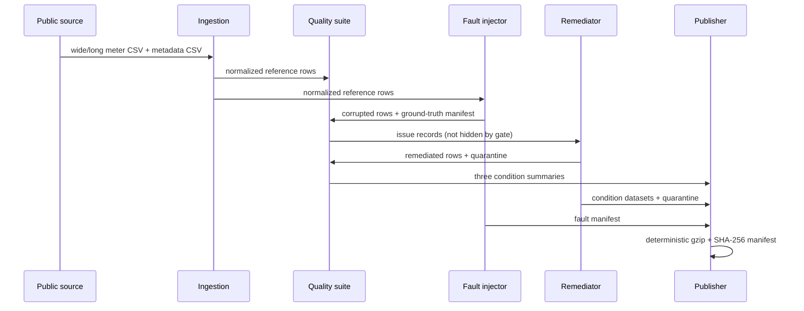

# Architecture and invariants

## Data flow



In v3 the ingestion step also normalizes site weather onto the same hourly
grid and publishes it as `weather.csv.gz`; the fault injector and remediator
never touch it. The quality suite first calibrates its run detectors per
building on the reference rows before the fault cutoff, writes
`detector_calibration.csv`, and then applies those frozen thresholds to every
condition.

## Enforced invariants

1. Condition datasets expose only
   `timestamp,building_id,load,site_id,primary_use,condition`.
2. `(timestamp, building_id)` is the logical observation key.
3. Every injected edit, addition, removal, or timestamp shift originates from
   an observation strictly before the explicit fault cutoff and remains before
   that cutoff.
4. Rows at and after the cutoff are byte-equivalent at the normalized value
   level between reference and corrupted conditions.
5. Remediation never reads a later observation to repair an earlier one.
6. Unrepairable rows are preserved in quarantine with reason codes.
7. Source rows are never overwritten in place; every condition is published as
   a separate artifact.
8. Local absolute paths, secrets, and user state are excluded
   from published manifests.

## Gate policy

The condition gate is the maximum status among its issue records after any
declared per-check threshold is applied:

```text
pass < warn < fail
```

A natural/reference `fail` blocks condition publication when
`abort_on_reference_fail` is enabled. Only clearly named `blocked_run.json` and
`blocked_quality_issues.csv.gz` diagnostics are written; no condition file or
success manifest is created. Seeded corrupted/detector conditions remain
reportable rather than being mistaken for natural source failures. Every gate
decision records its exact affected count, denominator, rate, threshold basis,
threshold values, and strict comparison semantics. Unknown issue-code keys in
the policy are rejected to catch misspellings.

Source-manifest availability and source-file byte size/SHA-256 verification
are unconditional for non-fixture runs and cannot be downgraded by a quality
threshold.

The following reference failures are also unconditional and block publication
even if `abort_on_reference_fail` is false or `fail_severities` omits `fail`:

- required-schema or timestamp-parse failure, because observation identity is
  not recoverable without guessing;
- duplicate observation keys, because the authoritative value for a key is
  ambiguous;
- missing, duplicate, or unstable building metadata, because the many-to-one
  join and subgroup identity are not valid;
- a selected building missing from one side of the committed split boundary,
  because the controlled train/evaluation comparison would not cover it.

These correspond to the hard-code set in `gates.py`; configurable thresholds
remain appropriate only for tolerable value-quality and coverage rates.
Every threshold must be finite and non-negative; rate thresholds are restricted
to the closed interval `[0, 1]`. Invalid policy values stop the run rather than
falling back to a detector default.

## Fault-boundary rationale

The downstream repository may train on observations before `fault_cutoff` and
evaluate on observations at or after it. Enforcing the cutoff inside the fault
injector—not merely documenting it—prevents accidental changes to evaluation
targets and makes the three-condition comparison auditable.
