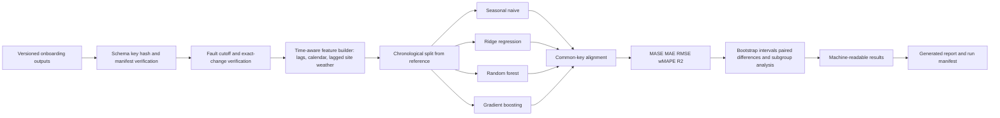

# Architecture

Rendered copy: [`architecture_forecasting.png`](../../docs/figures/architecture_forecasting.png) (source below).

`verify-inputs` fails before model fitting if producer files do not match their manifests, condition keys differ, a changed corrupted value is undocumented, or a fault violates its declared cutoff. The experiment then enforces that actual faults are training-only. Test targets are joined exclusively from reference data, and finite predictions are re-aligned onto one common key set before any metric is computed.

`verify-results` checks the required artifacts, result hashes, unique prediction keys, condition/model coverage, shared targets, common-key alignment, paired output, and four subgroup dimensions. The pipeline is stateless between runs. Reproducibility comes from versioned public data, hashes, code, configurations, seeds, and machine-readable outputs.
