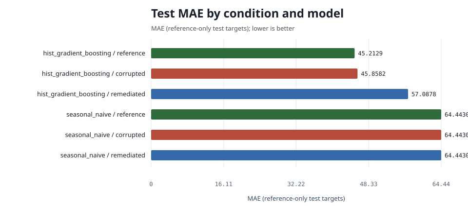
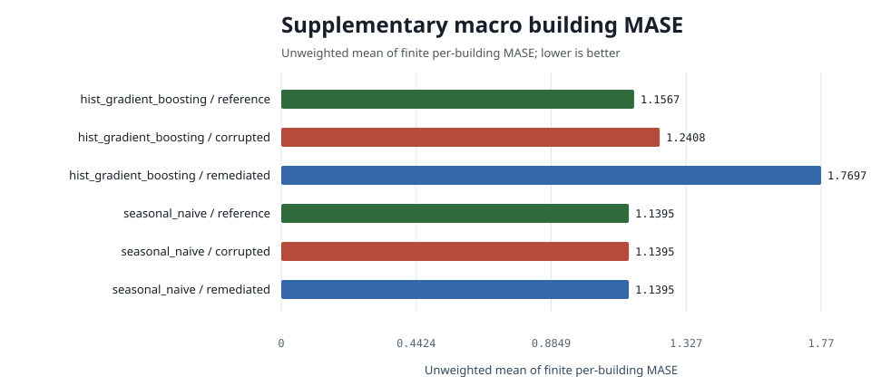

# Energy Demand Forecasting Experiment Report

Generated from machine-readable results for a retrospective public-data experiment.

## Protocol summary

- Train end: `2016-12-31T23:00:00+00:00`
- Validation end: `2017-03-31T23:00:00+00:00`
- Test end: `2017-12-31T23:00:00+00:00`
- Validation use: reserved; canonical models and hyperparameters fixed a priori
- Common evaluation keys: `79178`
- Prediction rows across all condition/model pairs: `475068`
- Seed: `20251206`
- Test-target source: `reference`
- State policy: stateless; no conversational state or personal data

## Complete primary results

| condition | model | n | mae | rmse | wmape | mase | r2 | mae_ci_low | mae_ci_high | mase_macro_building | mase_buildings_evaluated | mase_buildings_undefined | training_rows | data_retained |
| --- | --- | --- | --- | --- | --- | --- | --- | --- | --- | --- | --- | --- | --- | --- |
| corrupted | hist_gradient_boosting | 79178 | 45.8582 | 138.2894 | 0.1078 | 0.7403 | 0.9491 | 44.8897 | 46.8056 | 1.2408 | 12 | 0 | 105399 | 0.9999 |
| reference | hist_gradient_boosting | 79178 | 45.2129 | 134.0276 | 0.1063 | 0.7299 | 0.9522 | 44.2645 | 46.1472 | 1.1567 | 12 | 0 | 105400 | 0.9999 |
| remediated | hist_gradient_boosting | 79178 | 57.0878 | 142.0589 | 0.1342 | 0.9216 | 0.9463 | 56.1768 | 57.9918 | 1.7697 | 12 | 0 | 83375 | 0.7910 |
| corrupted | seasonal_naive | 79178 | 64.4430 | 210.7660 | 0.1515 | 1.0404 | 0.8817 | 63.0987 | 65.8824 | 1.1395 | 12 | 0 | 105399 | 0.9999 |
| reference | seasonal_naive | 79178 | 64.4430 | 210.7660 | 0.1515 | 1.0404 | 0.8817 | 63.0987 | 65.8824 | 1.1395 | 12 | 0 | 105400 | 0.9999 |
| remediated | seasonal_naive | 79178 | 64.4430 | 210.7660 | 0.1515 | 1.0404 | 0.8817 | 63.0987 | 65.8824 | 1.1395 | 12 | 0 | 83375 | 0.7910 |

`mase` remains the canonical pooled MASE-168 primary metric. The supplementary
`mase_macro_building` is the unweighted mean of finite building-specific MASE
values; every denominator comes from that building's reference training history.
Coverage and undefined-denominator counts are reported alongside it and in
`building_mase.csv`.

## Paired corrupted-versus-remediated differences

`mean_difference` is remediated absolute error minus corrupted absolute error
on identical test keys. Negative values favor remediation; positive values do not.

| model | n | corrupted_mae | remediated_mae | mean_difference | difference_ci_low | difference_ci_high |
| --- | --- | --- | --- | --- | --- | --- |
| hist_gradient_boosting | 79178 | 45.8582 | 57.0878 | 11.2296 | 10.8469 | 11.5926 |
| seasonal_naive | 79178 | 64.4430 | 64.4430 | 0.0000 | 0.0000 | 0.0000 |

## Coverage and subgroup robustness

`subgroup_metrics.csv` reports site, primary-use, building, and calendar-quarter
subgroups. These are coverage and robustness slices, not a fairness assessment.

## Interpretation boundary

The table includes every configured condition and model. A lower error is better, but causal interpretation is limited to the documented seeded fault suite and deterministic remediation. Natural source-data comparisons remain observational. Consult `subgroup_metrics.csv`, `predictions.csv.gz`, and `run_manifest.json` for the complete record.
