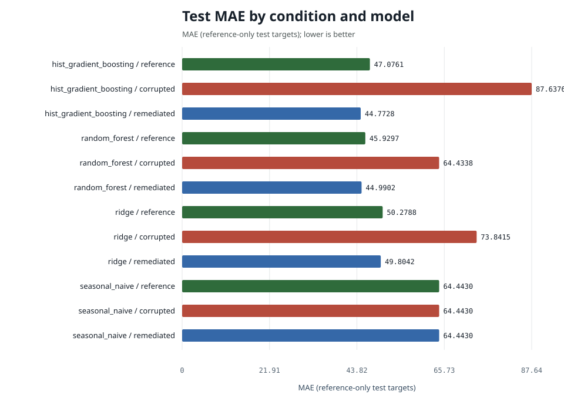
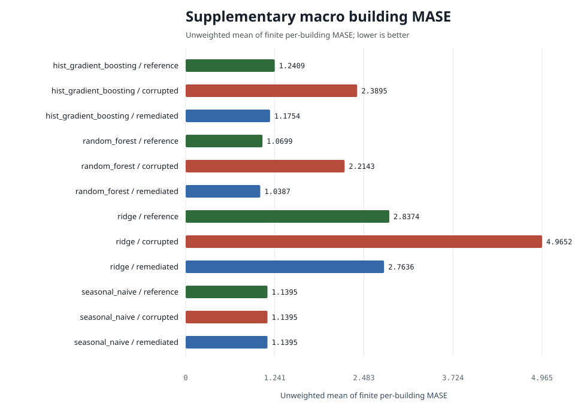

# Energy Demand Forecasting Experiment Report

Generated from machine-readable results for a retrospective public-data experiment.

## Protocol summary

- Train end: `2016-12-31T23:00:00+00:00`
- Validation end: `2017-03-31T23:00:00+00:00`
- Test end: `2017-12-31T23:00:00+00:00`
- Validation use: reserved; canonical models and hyperparameters fixed a priori
- Common evaluation keys: `79178`
- Prediction rows across all condition/model pairs: `950136`
- Seed: `20251206`
- Test-target source: `reference`
- State policy: stateless batch run; public data only, no personal data

## Complete primary results

| condition | model | n | mae | rmse | wmape | mase | r2 | mae_ci_low | mae_ci_high | mase_macro_building | mase_buildings_evaluated | mase_buildings_undefined | training_rows | data_retained |
| --- | --- | --- | --- | --- | --- | --- | --- | --- | --- | --- | --- | --- | --- | --- |
| corrupted | hist_gradient_boosting | 79178 | 87.6376 | 316.8519 | 0.2061 | 1.4148 | 0.7327 | 85.6603 | 89.5631 | 2.3895 | 12 | 0 | 105396 | 0.9999 |
| reference | hist_gradient_boosting | 79178 | 47.0761 | 133.6504 | 0.1107 | 0.7600 | 0.9524 | 46.1033 | 48.0075 | 1.2409 | 12 | 0 | 105400 | 0.9999 |
| remediated | hist_gradient_boosting | 79178 | 45.1427 | 127.0113 | 0.1061 | 0.7288 | 0.9570 | 44.2605 | 45.9912 | 1.1754 | 12 | 0 | 97978 | 0.9295 |
| corrupted | random_forest | 79178 | 64.4338 | 193.4664 | 0.1515 | 1.0402 | 0.9003 | 63.0968 | 65.6383 | 2.2143 | 12 | 0 | 105396 | 0.9999 |
| reference | random_forest | 79178 | 45.9297 | 134.0743 | 0.1080 | 0.7415 | 0.9521 | 45.0071 | 46.9097 | 1.0699 | 12 | 0 | 105400 | 0.9999 |
| remediated | random_forest | 79178 | 44.2913 | 130.1157 | 0.1041 | 0.7150 | 0.9549 | 43.4654 | 45.1660 | 1.0387 | 12 | 0 | 97978 | 0.9295 |
| corrupted | ridge | 79178 | 73.8415 | 147.8856 | 0.1736 | 1.1921 | 0.9418 | 72.9296 | 74.7281 | 4.9652 | 12 | 0 | 105396 | 0.9999 |
| reference | ridge | 79178 | 50.2788 | 127.0282 | 0.1182 | 0.8117 | 0.9570 | 49.4781 | 51.1080 | 2.8374 | 12 | 0 | 105400 | 0.9999 |
| remediated | ridge | 79178 | 50.0969 | 127.1130 | 0.1178 | 0.8088 | 0.9570 | 49.3040 | 50.9227 | 2.7636 | 12 | 0 | 97978 | 0.9295 |
| corrupted | seasonal_naive | 79178 | 64.4430 | 210.7660 | 0.1515 | 1.0404 | 0.8817 | 63.0987 | 65.8824 | 1.1395 | 12 | 0 | 105396 | 0.9999 |
| reference | seasonal_naive | 79178 | 64.4430 | 210.7660 | 0.1515 | 1.0404 | 0.8817 | 63.0987 | 65.8824 | 1.1395 | 12 | 0 | 105400 | 0.9999 |
| remediated | seasonal_naive | 79178 | 64.4430 | 210.7660 | 0.1515 | 1.0404 | 0.8817 | 63.0987 | 65.8824 | 1.1395 | 12 | 0 | 97978 | 0.9295 |

`mase` remains the canonical pooled MASE-168 primary metric. The supplementary
`mase_macro_building` is the unweighted mean of finite building-specific MASE
values; every denominator comes from that building's reference training history.
Coverage and undefined-denominator counts are reported alongside it and in
`building_mase.csv`.

## Findings in words

For hist_gradient_boosting, pooled MASE is 0.760 on reference training data, 1.415 on corrupted data (+86.2%) and 0.729 after remediation (-48.5% versus corrupted); remediation recovered essentially all of the corruption penalty while keeping 93.0% of the reference training targets. Against the seasonal-naive baseline (MASE 1.040) the reference model is +26.9% better. The paired remediated-minus-corrupted MAE difference is -42.49 (95% interval -44.42 to -40.60; negative favors remediation).

For random_forest, pooled MASE is 0.741 on reference training data, 1.040 on corrupted data (+40.3%) and 0.715 after remediation (-31.3% versus corrupted); remediation recovered essentially all of the corruption penalty while keeping 93.0% of the reference training targets. Against the seasonal-naive baseline (MASE 1.040) the reference model is +28.7% better. The paired remediated-minus-corrupted MAE difference is -20.14 (95% interval -21.15 to -19.08; negative favors remediation).

For ridge, pooled MASE is 0.812 on reference training data, 1.192 on corrupted data (+46.9%) and 0.809 after remediation (-32.2% versus corrupted); remediation recovered essentially all of the corruption penalty while keeping 93.0% of the reference training targets. Against the seasonal-naive baseline (MASE 1.040) the reference model is +22.0% better. The paired remediated-minus-corrupted MAE difference is -23.74 (95% interval -24.22 to -23.32; negative favors remediation).

## Paired corrupted-versus-remediated differences

`mean_difference` is remediated absolute error minus corrupted absolute error
on identical test keys. Negative values favor remediation; positive values do not.

| model | n | corrupted_mae | remediated_mae | mean_difference | difference_ci_low | difference_ci_high |
| --- | --- | --- | --- | --- | --- | --- |
| hist_gradient_boosting | 79178 | 87.6376 | 45.1427 | -42.4949 | -44.4209 | -40.5976 |
| random_forest | 79178 | 64.4338 | 44.2913 | -20.1425 | -21.1466 | -19.0755 |
| ridge | 79178 | 73.8415 | 50.0969 | -23.7445 | -24.2161 | -23.3173 |
| seasonal_naive | 79178 | 64.4430 | 64.4430 | 0.0000 | 0.0000 | 0.0000 |

## Coverage and subgroup robustness

`subgroup_metrics.csv` reports site, primary-use, building, and calendar-quarter
subgroups. These are coverage and robustness slices, not a fairness assessment.

## Interpretation boundary

The table includes every configured condition and model. A lower error is better, but causal interpretation is limited to the documented seeded fault suite and deterministic remediation. Natural source-data comparisons remain observational. Consult `subgroup_metrics.csv`, `predictions.csv.gz`, and `run_manifest.json` for the complete record.
