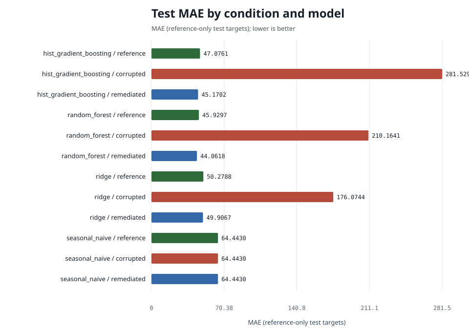
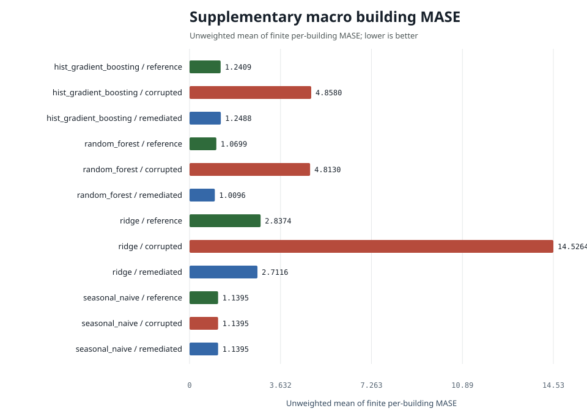

# Energy Demand Forecasting Experiment Report

Generated from machine-readable results for a retrospective public-data experiment.

## Protocol summary

- Train end: `2016-12-31T23:00:00+00:00`
- Validation end: `2017-03-31T23:00:00+00:00`
- Test end: `2017-12-31T23:00:00+00:00`
- Validation use: reserved; canonical models and hyperparameters fixed a priori
- Common evaluation keys: `79178`
- Prediction rows across all condition/model pairs: `950136`
- Seed: `20251206`
- Test-target source: `reference`
- State policy: stateless batch run; public data only, no personal data

## Complete primary results

| condition | model | n | mae | rmse | wmape | mase | r2 | mae_ci_low | mae_ci_high | mase_macro_building | mase_buildings_evaluated | mase_buildings_undefined | training_rows | data_retained |
| --- | --- | --- | --- | --- | --- | --- | --- | --- | --- | --- | --- | --- | --- | --- |
| corrupted | hist_gradient_boosting | 79178 | 281.5293 | 1575.7802 | 0.6620 | 4.5450 | -5.6120 | 271.2369 | 292.9805 | 4.8580 | 12 | 0 | 104800 | 0.9942 |
| reference | hist_gradient_boosting | 79178 | 47.0761 | 133.6504 | 0.1107 | 0.7600 | 0.9524 | 46.1033 | 48.0075 | 1.2409 | 12 | 0 | 105400 | 0.9999 |
| remediated | hist_gradient_boosting | 79178 | 45.1702 | 127.2135 | 0.1062 | 0.7292 | 0.9569 | 44.3249 | 46.0489 | 1.2488 | 12 | 0 | 100990 | 0.9581 |
| corrupted | random_forest | 79178 | 210.1641 | 905.0375 | 0.4942 | 3.3929 | -1.1811 | 204.5490 | 217.1587 | 4.8130 | 12 | 0 | 104800 | 0.9942 |
| reference | random_forest | 79178 | 45.9297 | 134.0743 | 0.1080 | 0.7415 | 0.9521 | 45.0071 | 46.9097 | 1.0699 | 12 | 0 | 105400 | 0.9999 |
| remediated | random_forest | 79178 | 44.0618 | 129.9644 | 0.1036 | 0.7113 | 0.9550 | 43.2346 | 44.9389 | 1.0096 | 12 | 0 | 100990 | 0.9581 |
| corrupted | ridge | 79178 | 176.0744 | 265.3943 | 0.4140 | 2.8425 | 0.8124 | 174.6662 | 177.4807 | 14.5264 | 12 | 0 | 104800 | 0.9942 |
| reference | ridge | 79178 | 50.2788 | 127.0282 | 0.1182 | 0.8117 | 0.9570 | 49.4781 | 51.1080 | 2.8374 | 12 | 0 | 105400 | 0.9999 |
| remediated | ridge | 79178 | 49.9067 | 126.9258 | 0.1173 | 0.8057 | 0.9571 | 49.1025 | 50.7288 | 2.7116 | 12 | 0 | 100990 | 0.9581 |
| corrupted | seasonal_naive | 79178 | 64.4430 | 210.7660 | 0.1515 | 1.0404 | 0.8817 | 63.0987 | 65.8824 | 1.1395 | 12 | 0 | 104800 | 0.9942 |
| reference | seasonal_naive | 79178 | 64.4430 | 210.7660 | 0.1515 | 1.0404 | 0.8817 | 63.0987 | 65.8824 | 1.1395 | 12 | 0 | 105400 | 0.9999 |
| remediated | seasonal_naive | 79178 | 64.4430 | 210.7660 | 0.1515 | 1.0404 | 0.8817 | 63.0987 | 65.8824 | 1.1395 | 12 | 0 | 100990 | 0.9581 |

`mase` remains the canonical pooled MASE-168 primary metric. The supplementary
`mase_macro_building` is the unweighted mean of finite building-specific MASE
values; every denominator comes from that building's reference training history.
Coverage and undefined-denominator counts are reported alongside it and in
`building_mase.csv`.

## Findings in words

For hist_gradient_boosting, pooled MASE is 0.760 on reference training data, 4.545 on corrupted data (+498.0%) and 0.729 after remediation (-84.0% versus corrupted); remediation recovered essentially all of the corruption penalty while keeping 95.8% of the reference training targets. Against the seasonal-naive baseline (MASE 1.040) the reference model is +26.9% better. The paired remediated-minus-corrupted MAE difference is -236.36 (95% interval -246.39 to -225.43; negative favors remediation).

For random_forest, pooled MASE is 0.741 on reference training data, 3.393 on corrupted data (+357.6%) and 0.711 after remediation (-79.0% versus corrupted); remediation recovered essentially all of the corruption penalty while keeping 95.8% of the reference training targets. Against the seasonal-naive baseline (MASE 1.040) the reference model is +28.7% better. The paired remediated-minus-corrupted MAE difference is -166.10 (95% interval -172.63 to -160.09; negative favors remediation).

For ridge, pooled MASE is 0.812 on reference training data, 2.843 on corrupted data (+250.2%) and 0.806 after remediation (-71.7% versus corrupted); remediation recovered essentially all of the corruption penalty while keeping 95.8% of the reference training targets. Against the seasonal-naive baseline (MASE 1.040) the reference model is +22.0% better. The paired remediated-minus-corrupted MAE difference is -126.17 (95% interval -127.27 to -124.98; negative favors remediation).

## Paired corrupted-versus-remediated differences

`mean_difference` is remediated absolute error minus corrupted absolute error
on identical test keys. Negative values favor remediation; positive values do not.

| model | n | corrupted_mae | remediated_mae | mean_difference | difference_ci_low | difference_ci_high |
| --- | --- | --- | --- | --- | --- | --- |
| hist_gradient_boosting | 79178 | 281.5293 | 45.1702 | -236.3591 | -246.3850 | -225.4320 |
| random_forest | 79178 | 210.1641 | 44.0618 | -166.1023 | -172.6314 | -160.0919 |
| ridge | 79178 | 176.0744 | 49.9067 | -126.1677 | -127.2680 | -124.9793 |
| seasonal_naive | 79178 | 64.4430 | 64.4430 | 0.0000 | 0.0000 | 0.0000 |

## Coverage and subgroup robustness

`subgroup_metrics.csv` reports site, primary-use, building, and calendar-quarter
subgroups. These are coverage and robustness slices, not a fairness assessment.

## Interpretation boundary

The table includes every configured condition and model. A lower error is better, but causal interpretation is limited to the documented seeded fault suite and deterministic remediation. Natural source-data comparisons remain observational. Consult `subgroup_metrics.csv`, `predictions.csv.gz`, and `run_manifest.json` for the complete record.
