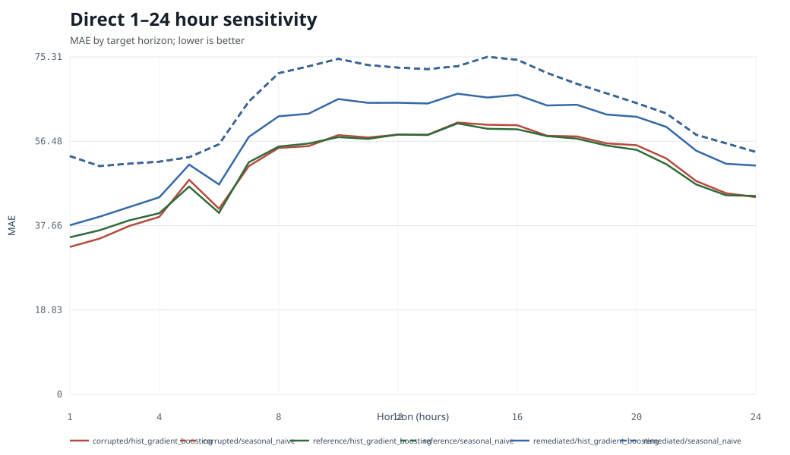

# Direct 1–24 Hour Forecast Sensitivity

This is a separate sensitivity analysis, not a replacement for the canonical
fixed-horizon 24-hour run and not a deployment claim.

## Locked design

- One forecast origin per source-local calendar day at hour `23`.
- Each origin predicts the complete 1–24 hour vector; stride is 24 hours.
- Full origin blocks are partitioned by target time. Blocks crossing a split
  boundary are embargoed and excluded.
- Train end marker: `2016-12-31T23:00:00+00:00`
- Validation end marker: `2017-03-31T23:00:00+00:00`
- Test end marker: `2017-12-31T23:00:00+00:00`
- Test targets: reference condition only.
- Condition parity at and after the fault cutoff: verified before fitting.
- Calendar features: preserved source-local wall-clock hour/day. The trailing
  `Z` comparison marker does not imply true UTC offset conversion.
- MAE intervals: whole building-week block bootstrap, streamed one repetition
  at a time; no rows-by-repetitions matrix.
- Pooled MASE-168 remains the primary sensitivity summary. Per-building and
  macro-building MASE are supplementary and use reference-training scales only.

## Complete results

| condition | model | n | mae | rmse | wmape | mase | r2 | mae_ci_low | mae_ci_high | mase_macro_building | mase_buildings_evaluated | mase_buildings_undefined |
| --- | --- | --- | --- | --- | --- | --- | --- | --- | --- | --- | --- | --- |
| corrupted | hist_gradient_boosting | 78960 | 50.9759 | 143.0194 | 0.1198 | 0.8229 | 0.9455 | 43.6002 | 60.5276 | 1.4963 | 12 | 0 |
| reference | hist_gradient_boosting | 78960 | 50.9041 | 142.4772 | 0.1196 | 0.8218 | 0.9460 | 43.7324 | 60.0497 | 1.4377 | 12 | 0 |
| remediated | hist_gradient_boosting | 78960 | 57.2727 | 137.4148 | 0.1346 | 0.9246 | 0.9497 | 50.0302 | 66.2488 | 1.7446 | 12 | 0 |
| corrupted | seasonal_naive | 78960 | 64.4769 | 210.7912 | 0.1515 | 1.0409 | 0.8817 | 52.2107 | 78.5953 | 1.1400 | 12 | 0 |
| reference | seasonal_naive | 78960 | 64.4769 | 210.7912 | 0.1515 | 1.0409 | 0.8817 | 52.2107 | 78.5953 | 1.1400 | 12 | 0 |
| remediated | seasonal_naive | 78960 | 64.4769 | 210.7912 | 0.1515 | 1.0409 | 0.8817 | 52.2107 | 78.5953 | 1.1400 | 12 | 0 |

## Per-horizon results

See `horizon_metrics.csv` and the deterministic chart below. Every condition,
model, and horizon from 1 through 24 is retained.

## Paired corrupted-versus-remediated differences

`mean_difference` is remediated absolute error minus corrupted absolute error
on the identical forecast keys. Negative values favor remediation. Intervals
resample the same whole building-week blocks used for sensitivity MAE.

| model | n | corrupted_mae | remediated_mae | mean_difference | difference_ci_low | difference_ci_high |
| --- | --- | --- | --- | --- | --- | --- |
| hist_gradient_boosting | 78960 | 50.9759 | 57.2727 | 6.2969 | 3.8931 | 9.0506 |
| seasonal_naive | 78960 | 64.4769 | 64.4769 | 0.0000 | 0.0000 | 0.0000 |

Per-horizon paired results are retained in
`horizon_paired_differences.csv`; no horizon is selected or omitted.

## Interpretation boundary

The sensitivity isolates horizon behavior under the recorded public-data
experiment. It does not alter the canonical fixed-h=24 result, establish
operational performance, or evaluate real-time deployment.
